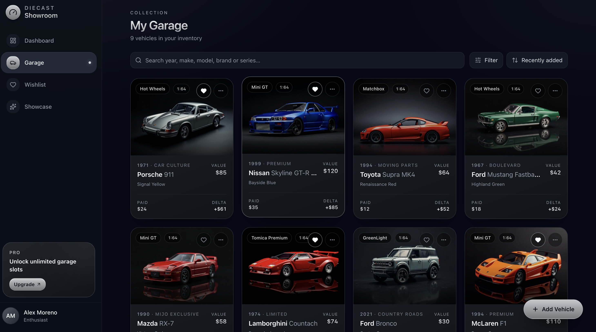
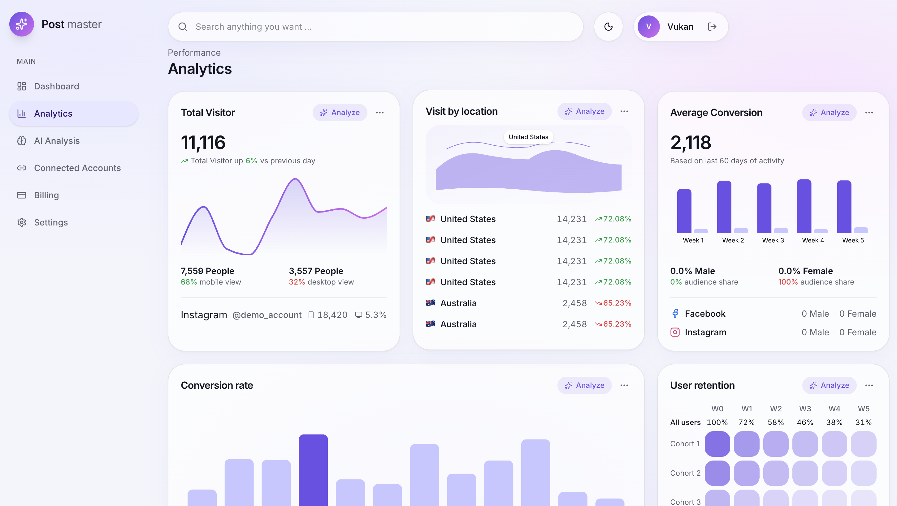
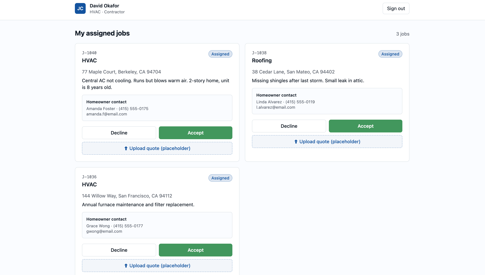

# Lovable Portfolio

A selection of web applications and SaaS products I’ve built using Lovable, Supabase, React, Stripe, and modern AI tools.

## 🚗 Diecast Showroom

A complete collection-management web application for diecast collectors.

**Built with:** Lovable, Supabase, React, Stripe

Features include:
- Authentication & user accounts
- Personal car collections
- Photo uploads
- Dashboard & collection statistics
- Wishlist
- Subscription system
- Admin functionality
- Responsive PWA experience

## 🤖 PostMasterAI

An AI-powered SaaS application for analyzing and improving social media content.

**Built with:** Lovable, Supabase, OpenAI API

Features include:
- User authentication
- AI-powered analysis
- User-specific data
- Dashboard workflows
- Persistent database storage

🔗 [Live Demo](https://ai-postmaster.com)

## 👥 GroupUp

A responsive web application concept built as a rapid product prototype.

**Built with:** Lovable, React

Focused on clean UI/UX, responsive design, and fast MVP development.

---

### More projects coming soon

I’m currently building additional SaaS applications, dashboards, and client portals using Lovable and Supabase.
